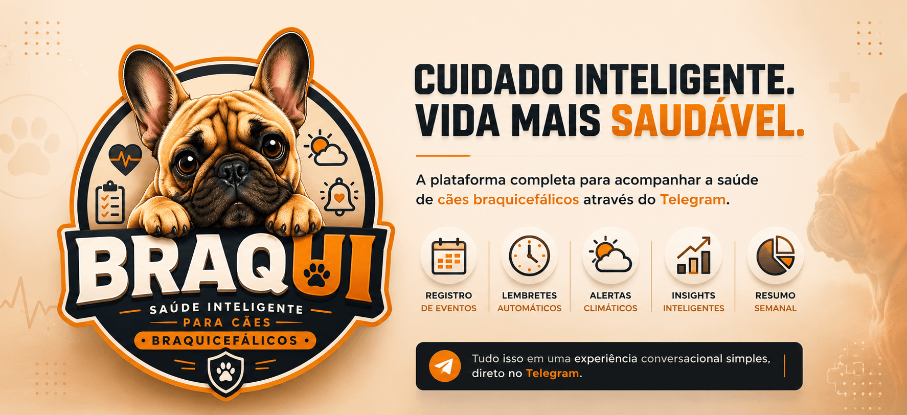

         

# 🐶 Braqui

**Saúde inteligente para cães braquicefálicos.**

Braqui é uma plataforma focada no acompanhamento da saúde e rotina de cães braquicefálicos, como Buldogue Francês, Pug, Shih Tzu, Boston Terrier, Bulldog Inglês e raças similares.

O objetivo é ajudar tutores a registrarem eventos importantes da rotina do pet, receberem lembretes, alertas climáticos e acompanharem a evolução da saúde do animal através de uma interface conversacional simples via Telegram.

---

## 🎯 Problema

Cães braquicefálicos possuem necessidades específicas relacionadas principalmente a:

* respiração;
* calor excessivo;
* ofegância;
* obesidade;
* alergias;
* problemas dermatológicos;
* rotina medicamentosa.

Grande parte dos tutores não possui um histórico organizado dos acontecimentos relacionados ao pet.

Informações importantes acabam se perdendo:

* episódios de vômito;
* crises de coceira;
* consultas veterinárias;
* medicamentos administrados;
* mudanças de comportamento.

O Braqui nasce para resolver esse problema.

---

## 🚀 MVP

O MVP possui foco em:

* cadastro do tutor;
* cadastro do pet;
* registro de eventos;
* histórico de eventos;
* insights básicos;
* lembretes;
* alertas climáticos;
* resumo semanal.

Tudo através de uma experiência conversacional no Telegram.

---

## 🏗️ Arquitetura

O projeto utiliza arquitetura modular organizada em monorepo.

```text
/apps
  /api
  /dashboard
  /admin

/docs
  /specs

docker-compose.yml
README.md
```

Inicialmente apenas a aplicação `api` será implementada.

As aplicações `dashboard` e `admin` permanecem previstas para futuras evoluções.

---

## ⚙️ Stack Tecnológica

### Backend

* Go
* PostgreSQL
* Docker
* Docker Compose

### Integrações

* Telegram Bot API
* Google Gemini
* OpenWeather

### Infraestrutura

* Docker
* GitHub
* Deploy Cloud (Render / Railway / Fly.io)

---

## 🐳 Ambiente Local

Subir ambiente:

```bash
docker compose up
```

Parar ambiente:

```bash
docker compose down
```

Rebuild:

```bash
docker compose up --build
```

---

## 🤖 Desenvolvimento Assistido por IA

Este projeto foi construído utilizando práticas modernas de **AI-Assisted Software Development**.

|Categoria|Ferramenta|
|---|---|
|IDE/Agent|OpenCode|
|Modelo Principal|DeepSeek V4 Flash (via OpenCode)|
|Apoio Estratégico|ChatGPT (GPT-5.5)|
|Metodologia|Spec-Driven Development (SDD)|

O desenvolvimento foi conduzido a partir de especificações formais (Specs), seguindo uma abordagem **SDD**, onde cada funcionalidade é planejada, documentada e validada antes da implementação.

Foram produzidos documentos de visão, arquitetura, roadmap e mais de 20 especificações funcionais que serviram como base para a construção do sistema.

### 📋 Especificações do Projeto

As funcionalidades do Braqui foram planejadas e organizadas através de documentos de especificação localizados em `/docs/specs`, contendo:

- Objetivos da funcionalidade
- Regras de negócio
- Critérios de aceitação
- Fluxos de uso
- Checklist de implementação

### 📚 Documentação

- `docs/vision.md`
- `docs/architecture.md`
- `docs/roadmap.md`
- `docs/specs/`

A IA foi utilizada para auxiliar na definição de arquitetura, refinamento de requisitos, geração de documentação técnica, criação de planos de implementação e desenvolvimento de código, sempre sob revisão humana.

---

## 📋 Roadmap Inicial

### Fundação

* Bootstrap
* Configuração
* Infraestrutura
* Docker
* Persistência

### Plataforma

* Telegram
* Onboarding
* Cadastro de Pet
* Estado Conversacional
* Router

### Inteligência

* Parser Local
* IA
* Registro de Eventos
* Timeline

### Automação

* Scheduler
* Lembretes
* Alertas Climáticos

### Valor ao Usuário

* Insights
* Resumo Semanal

---

## 🔒 Status

Projeto em desenvolvimento.

Atualmente em fase de implementação do MVP.

---

## 📄 Licença

MIT
